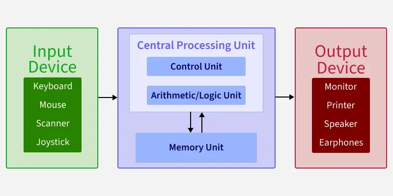

# Primitives vs Objects

This is the foundational piece of knowledge every programmer should know.

We have primitive data types: `number`, `string`, `null`, `undefined`, `boolean`, `Symbol`, `BigInt`.
We have complex data types: `array`, `object`, but in JS language `array`, `object` or `function` are essentially objects.

Primitives in JS are immutable. When you manipulate a primitive, you are creating a new value, not modifying the old one. And you pass the primitive into function, or return from function as a value.

## Historical references

It all goes in to [Von Neumann architecture](https://en.wikipedia.org/wiki/Von_Neumann_architecture) that is the standard for most of the devices we use.

https://www.geeksforgeeks.org/computer-organization-architecture/computer-organization-von-neumann-architecture/

Von Neumann architecture:

- CPU (Central Arithmetic Unit) - performs binary math (addition, subtraction, AND/OR logic) on "values" pulled from memory.
- Central Control Unit - this is the part of the CPU chip that manages the instruction cycle. It fetches code from the RAM, decodes what the code wants to do, and then sends electrical signals to the Arithmetic Unit to execute it.
- RAM (Memory) - it is a massive, high-speed grid of cells. Every primitive (value) and object (link/pointer) must be loaded here before the CPU can see it.
- SSD - long term memory. The CPU cannot "talk" to the SSD directly; it must request the data be moved to RAM first.
- Keyboard / Monitor (Input & Output Mechanisms)

## Von Neumann Bottleneck

Idea of pointers/links and values was invented as a way to utilize memory and hardware part more effectively (CPU-RAM Interface). While primitive data types have their limits, you can construct an object that can be enormous (JSON, for example). So instead of passing objects by value, we pass them by pointer/link. 
Every time you propagate the variable of object, function or array, you are not propagating the value, but a link to the specific part in heap memory.

## Why do we care?

This is the foundational principle for everything, starting from immutability, idempotence, programming paradigms, algorithms, effective memory management.

On the utilitarian level if you don't know that passing tan object into the function can cause side effects of mutation that can break the logic out of that function - you are in a trouble.

## Once more

Know the difference between primitives and objects and how they affect your code.

Every time you propagate the variable of object you are not propagating the value, but a link to the specific part in heap memory.
