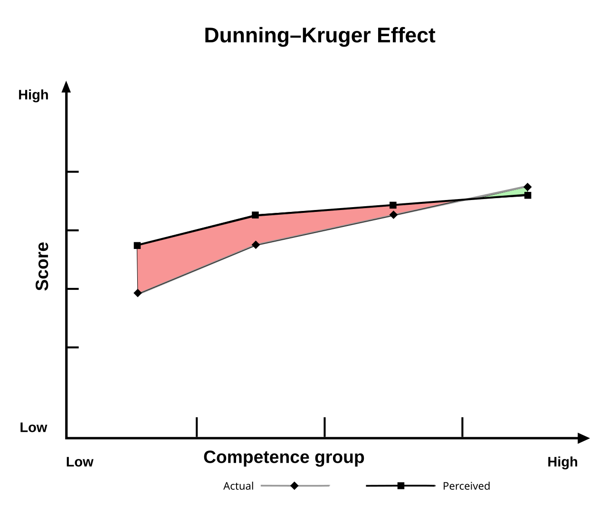

# Code reviews

### Why do we need code reviews?

We are engineering complex systems, that will be used on a big scale that can lead to:

- If your code is **Unstable**, and works for `95%` of cases, but fails on `5%`, with `100,000` or users `95,000` of them will be good, but `5,000` of them will have problems.
- If you code works for **Happy path**, it doesn't mean that it will work for all scenarios.
- If your code is **Insecure**, the business will have problems with leaked data, and in our domain, the PHI data breaches are legal precedents that will cost a lot of resources.
- If your code is **not Scalable**, the cost of any new feature will be enormous.
- If your code is **not Readable**, it is not Scalable as well.
- If your code is **not Tested** you don't know that edge cases are covered.

In academia, a Reviewer is an expert in a specific field who evaluates a researcher's manuscript (article, book chapter, conference paper) for quality, validity, originality, and significance before publication. The same is for code reviews.

**We need that stage, but we need to be mindful about HOW we are doing that. With the recent adoption of LLMs we all will be Reviewers and we need to do this very good.**

**About Cargo cult**

The first documented cargo cults were movements that foretold followers would imminently receive an abundance of food and goods (the "cargo") brought by their ancestors.

**Link**: [https://en.wikipedia.org/wiki/Cargo_cult_programming](https://en.wikipedia.org/wiki/Cargo_cult_programming)

Cargo cults have a wide diversity of beliefs and practices, but typically (though not universally) include:

- prophet figures foretelling a coming cataclysm or utopia for followers predictions by these prophets of the return of dead ancestors or other powerful beings bringing the cargo;
- the belief that ancestral spirits were responsible for the creation of the cargo;
- **the instruction by these prophets to followers to fulfill the prophecy** by either reviving ancestral traditions or adopting new rituals, such as ecstatic dancing or imitating the actions of colonists and military personnel, like flag-raising, marching and drilling.

The example of a Cargo cult can be very relevant to the bad way of doing code reviews. We act like we are doing code reviews, we look into the code, but we are examining the surface level of an iceberg. Sometimes we are imitating code reviews rather than doing them.

**How can we do code reviews better?**

The answer might be in the formalization of code review process. We need to know what we are doing, why and how we should do it to get effective results.

## Cognitive biases of engineers

[](./images/Dunning–Kruger_Effect2.png)

Programmer's mind sometimes can be in the state in-between **Imposter syndrome** and **Dunning–Kruger effects**, in a form is spectrum. One day you are in the state of Imposter syndrome with thoughts "I'm a fake, I have zero knowledge, I should be doing capentry". Another day you are in a "God mode" of Dunning–Kruger effect, with thoughts "I'm a genius, whow!".

The answer might somewhere in the middle ground.

I think it is important to be aware of these 2 extremeties to stop yourself and to take a breath. We are just humans here, we need to remember that we are "Standing on the shoulders of giants" [https://en.wikipedia.org/wiki/Standing_on_the_shoulders_of_giants](https://en.wikipedia.org/wiki/Standing_on_the_shoulders_of_giants) and we always have new things to learn.

## Code review roles

We have 2 roles here:

- **Author** - person that submitted the code. The code should be tested, read through, and should solve the problem. This goal of person here is a cross-checking of a solution from colleagues, with constructive feedback.
- **Reviewer** - person that shares the same domain and language knowledge, is in the context and can look into the code from a side point of view. Their goal is to help an Author with constructive feedback, to find flaws in the logic, to suggest a better approach.

**Both of them, Author ans Reviewer are NOT here for:**

- Meaningless critique
- Proving who is smarter
- Playing mind games

Both of them are learning at the same time.

It is common that Author is more knowledgeble than Reviewer, but they forget something, or added some typos, some nuances, while less knowledgeble reviewer can pinpoint on that.

It is important to listen to meaningful feedback, and learn from it.

## Fromalization of a process

There is a book "The Programmer's Brain: What Every Programmer Needs to Know about Cognition" by Felienne Hermans. The author explains 3 types of code we see every day.

### Oh my God, what is it?

Example:

```apl
{⍺ ← ¯99 ⋄ ⍺+⍵} 99
57 {⍺ ← ¯99 ⋄ ⍺+⍵} 99
```

This is the APL language. Hell knows what is happening there. You are definitely not an expert here, you have a total lack of knowledge.

**Solution:** read the documentation, expect that it will take some time. If you still can't get what is happening in the code, maybe you should not review this code? Maybe you need to explicitly tell this, like "Hey, I'm not an expert here, should we find another person to review that?". it is bad idea to mindlessly click "Approve", thinking that "Naaahh, let's pretend that it is ok".

### Looks faimiliar, but what is that?

Example:

```js
async function bytesToBase64DataUrl(bytes, type = "application/octet-stream") {
  return await new Promise((resolve, reject) => {
    const reader = Object.assign(new FileReader(), {
      onload: () => resolve(reader.result),
      onerror: () => reject(reader.error),
    });
    reader.readAsDataURL(new File([bytes], "", { type }));
  });
}
```

You have some familiarity, but the usage of `FileReader` here might be unknown to you.

**Solution:** read abot the `FileReader`, try to understand how it works and get back to the code and try to understand it one more time.

### Looks ok, but how can I read all of that?

Example:

```js
/**
 * A specialized version of `baseIsEqualDeep` for arrays with support for
 * partial deep comparisons.
 *
 * @private
 * @param {Array} array The array to compare.
 * @param {Array} other The other array to compare.
 * @param {number} bitmask The bitmask flags. See `baseIsEqual` for more details.
 * @param {Function} customizer The function to customize comparisons.
 * @param {Function} equalFunc The function to determine equivalents of values.
 * @param {Object} stack Tracks traversed `array` and `other` objects.
 * @returns {boolean} Returns `true` if the arrays are equivalent, else `false`.
 */
function equalArrays(array, other, bitmask, customizer, equalFunc, stack) {
  var isPartial = bitmask & COMPARE_PARTIAL_FLAG,
    arrLength = array.length,
    othLength = other.length;

  if (arrLength != othLength && !(isPartial && othLength > arrLength)) {
    return false;
  }
  // Check that cyclic values are equal.
  var arrStacked = stack.get(array);
  var othStacked = stack.get(other);
  if (arrStacked && othStacked) {
    return arrStacked == other && othStacked == array;
  }
  var index = -1,
    result = true,
    seen = bitmask & COMPARE_UNORDERED_FLAG ? [] : undefined;

  // Ignore non-index properties.
  while (++index < arrLength) {
    var arrValue = array[index],
      othValue = other[index];

    var compared;
    if (compared !== undefined) {
      if (compared) {
        continue;
      }
      result = false;
      break;
    }
    // Recursively compare arrays (susceptible to call stack limits).
    if (seen) {
      if (
        !baseSome(other, function (othValue, othIndex) {
          if (
            !indexOf(seen, othIndex) &&
            (arrValue === othValue ||
              equalFunc(arrValue, othValue, bitmask, customizer, stack))
          ) {
            return seen.push(othIndex);
          }
        })
      ) {
        result = false;
        break;
      }
    } else if (
      !(
        arrValue === othValue ||
        equalFunc(arrValue, othValue, bitmask, customizer, stack)
      )
    ) {
      result = false;
      break;
    }
  }
  return result;
}
```

The code seems to be familiar, but there is too much code to immediately grasp the logic of it. Every person has a different brain capacity, it is like a RAM memory, some devices have 36GB, some 8GB, and they need to do more frequent "requests" and brain memory work.

**Solution:** use pen and paper, use Rubber duck debugging [https://en.wikipedia.org/wiki/Rubber_duck_debugging](https://en.wikipedia.org/wiki/Rubber_duck_debugging). Read the code sequentially, try to **understand the logic of every line**. If you lost the train of thoughts - take a pause and return back to it.

We need to differentiate between these 3 types and approach the code differently.

## Code review starting point: Syntax vs Business logic

This the part where we actually read the code.

We have 2 aspects of a code: **Syntax** and **Meaning** (business logic). In my code reviews I usually starting with Syntax side.

### Code review: Syntax

On this stage I look for:

- **Code Smells** - I need to know about language-specific Code Smells.
- **Language syntax correctness, Best Practices violations** - I need to know about domain-specific Best Practices (SOLID, KISS, DRY, etc.)
- **Violation of common agreements of the project** - I need to remember common agreements of the project
- **Lack of descriptions, comments**
- **Violation of programming paradygms** - violation of SOLID, DRY, KISS, pure functions, etc.
- **Lack of unit test (or integration) coverage** - if these unit tests are needed.
- **Inefficient performance** - I need to know about BigO notation.
- **Security violations** - I need to know about XSS, RCE, OWASP, STIGs.

If some of these areas are violated, I'm adding comments in a polite manner.

### Code review: Meaning

On this stage I'm opening the Jira ticket description and trying to understand the task:

- **What is the TYPE of the task: Bug, Feature, R&D, Refactoring**?
- **What is the Problem here?**
- **What we need to achive here?**

If I have troubles with these questions I'm asking clarifying questions.

**If have no clarity and no answers from PM, BA, stakeholders - I can stop reviewing code. If I have no clarity of expected result - I will not understand the solution.**

I'm verifying the pull request from business logic point.

- What is the Problem this pull request is trying to solve?
- What is the Input here?
- What we get as an Output?
- Are there any side effects in this pull request?

This stage can be most complex. Sometimes you need even need to think about "How would I solve this problem?", up to implementing a soltuion on your own.

## Code review: what can we automate

You need to have a descent level of automations to have some sort of alert system that will fail the pull request and to save your time. Machine will allways be more precise than human, if it has a correct setup.

Use Gitlab pipelines, Github actions to create an effective verification pipelines that will include:

- Linting checks (ESlint, Biome, Prettier)
- Unit test run (Vitest, Jest, Playwright)
- SonarQube analysis
- LLMs analysis (.md files with instructions)

**Use fail first approach**. If Linting is incorrect - fail the whole pipeline and do not proceed to the next step, save computational time of your servers.

## Code review: How much time it takes? How much time it should take?

In May of 2006 Smart Bear Software company did a 10-month case study of peer code review in the Cisco MeetingPlace product group at Cisco Systems. With 2500 reviews of 3.2 million lines of code written by 50 developers.

[](./images/code-review-best-practices-figure-01.gif)

Here you see the number of defects found per 1000 lines of code.

As the amount of code under review increases reviewers become less effective at finding defects assuming a constant true number of defects per kLOC. Reviewers are most effective at reviewing small amounts of
code.
Anything below 200 lines produces a relatively high rate of defects, often several times the average.

If the reviewer is overwhelmed with a large quantity of code he won’t give the same attention to every line as he might with a small change.

**Their results allow us to conclude the following:**

- LOC (lines of code) under review should be under `200 LOC`, not to exceed `400 LOC`. Anything larger overwhelms reviewers and defects are not uncovered.
- Inspection rates less than `300 LOC/hour` result in best defect detection. Rates under `500 LOC/hour` are still good; expect to miss significant percentage of defects if faster than that.
- Authors who prepare the review with annotations and explanations have far fewer defects than those that do not. We presume the cause to be that authors are forced to self-review the code.
- Total review time should be less than `60 minutes`, not to exceed `90 minutes`. Defect detection rates plummet after that time.
- Expect defect rates around `15 per hour`. Can be higher only with less than `175 LOC` under review.

> It can be tempting to tear through a review, assuming that someone else will catch the errors that you don't find. However, SmartBear research shows a significant drop in defect density at rates faster than `500 LOC per hour`. Code reviews in reasonable quantity, at a slower pace for a limited amount of time results in the most effective code review.

**Link:** Code Review at Cisco
Systems [https://static0.smartbear.co/support/media/resources/cc/book/code-review-cisco-case-study.pdf](https://static0.smartbear.co/support/media/resources/cc/book/code-review-cisco-case-study.pdf)

**What to read**:

- [https://en.wikipedia.org/wiki/Impostor_syndrome](https://en.wikipedia.org/wiki/Impostor_syndrome)
- [https://en.wikipedia.org/wiki/Dunning%E2%80%93Kruger_effect](https://en.wikipedia.org/wiki/Dunning%E2%80%93Kruger_effect)
- Rubber duck debugging [https://en.wikipedia.org/wiki/Rubber_duck_debugging](https://en.wikipedia.org/wiki/Rubber_duck_debugging)
- "The Programmer's Brain: What Every Programmer Needs to Know about Cognition" by Felienne Hermans [https://www.amazon.ca/Programmers-Brain-every-programmer-cognition/dp/1617298670](https://www.amazon.ca/Programmers-Brain-every-programmer-cognition/dp/1617298670)
