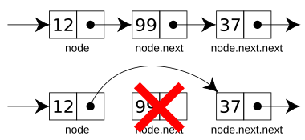

# Linked List

[](./images/CPT-LinkedLists-deletingnode.svg.png)

A linear data structure where elements are not stored in contiguous memory locations. Instead, each element (node) is a separate object that contains a value and a pointer (reference) to the next node in the sequence.

Be aware that you need to know the difference between a `Singly Linked List` (one-way pointers, only `next`) and a `Doubly Linked List` (pointers to both `next` and `prev` nodes).

And you need to know the difference between passing an element as a primitive or as a link.

## Big O and operations

| Create       | Read | Update | Delete | Find |
| ------------ | ---- | ------ | ------ | ---- |
| O(1) at head | O(n) | O(1)   | O(1)   | O(n) |

## Possible operations and cost

```javascript
class Node {
  constructor(data) {
    this.val = data;
    this.next = null;
  }
}

let head = new Node(1);
let second = new Node(1);

// O(1)
head.next = second;

// O(n) - Accessing the 5th element
// Unlike an Array, we cannot do list[5]. We must loop.
let current = head;
for (let i = 0; i < 5; i++) {
  current = current.next;
}
```

## When to use

When you need frequent Insert/Delete at start or in the in-between elements, when you don't know how many elements you will have.

## When to avoid

If you have a small dataset the overhead can be significant, the cognitive complexity is high here.

## Linked List in React

````ts
const newHook: Hook = {
      memoizedState: currentHook.memoizedState,

      baseState: currentHook.baseState,
      baseQueue: currentHook.baseQueue,
      queue: currentHook.queue,

      next: null,
    };
```

Source code: https://github.com/facebook/react/blob/1721e73e149d482a4421d4ea9f76d36a2c79ad02/packages/react-reconciler/src/ReactFiberHooks.js#L980
````

