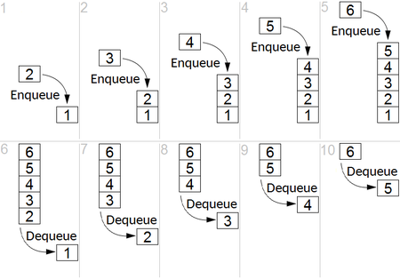

# Queue (FIFO) Abstract Data Type

[](./images/450px-Fifo_queue.png)

FIFO is an abbreviation for first in, first out. You can imagine it as a pipe, where you put items from one side but pull items from the other side only.

Be aware that Array-based Queue is a non-scalable solution.

## Big O and operations

| Create | Read            | Update          | Delete       | Find |
| ------ | --------------- | --------------- | ------------ | ---- |
| O(1)   | O(1) peek front | O(1) front only | O(n) dequeue | O(n) |

## Possible operations and cost

```javascript
const queue = [];

// O(1)
queue.push(1);
console.log(queue[0]); // get first one
queue[0] = 5;

// O(n)
queue.shift(); // Wooow, this is bad!
console.log(arr.find((item) => item === 10));
```

## When to use

If you need to retain LIFO order of adding and removing items. The JavaScript Event Loop uses a Macrotask Queue to manage operations. Systems like RabbitMQ or Kafka are essentially massive, distributed FIFO queues.

## When to avoid

If you need LIFO operations (use a Stack instead), search by value, when you have huge datasets. You can check Linked Lists that can give you O(1).

