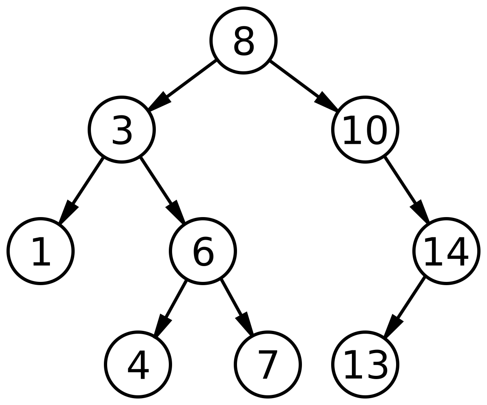

# Big O

Big O notation is a mathematical asymptotical notation that describes the limiting behavior of a function when the argument tends towards a particular value or infinity.

The letter O stand for Ordnung, meaning the order of approximation. The letter O is used because the growth rate of a function is also referred to as the order of the function.

### Formula

$${f(x)} \in O(g(x)) \ where \ {x \to \infty}$$

### Growth functions g(x) classification

| Big O Notation |    Name     | Example Operations                               |
| :------------- | :---------: | :----------------------------------------------- |
| O(1)           |  Constant   | Array access, hash table lookup                  |
| O(log n)       | Logarithmic | Binary search, balanced tree operations          |
| O(n)           |   Linear    | Linear search, single loop                       |
| O(n²)          |  Quadratic  | Bubble sort, nested loops                        |
| O(n³)          |    Cubic    | Triple nested loops, naive matrix multiplication |
| O(n^k)         | Polynomial  | k nested loops                                   |
| O(2^n)         | Exponential | Recursive Fibonacci, subset generation           |
| O(n!)          |  Factorial  | Permutations                                     |

### Chart

[](./images/Comparison_computational_complexity.svg.png)

### Data structures

#### Arrays

```javascript
const arr = [1, 2, 3, 4];
arr.push(5);
console.log(arr[2]);
arr[1] = 10;
arr.shift();
arr.pop();
arr.splice(0, 1);
console.log(arr.find((item) => item === 10));
```

| Create | Read          | Update        | Delete | Find |
| ------ | ------------- | ------------- | ------ | ---- |
| O(1)   | O(1) by index | O(1) by index | O(n)   | O(n) |

#### Stack (LIFO)

[](./images/Lifo_stack.svg)

LIFO is an abbreviation for last in, first out.

```javascript
const stack = [];
stack.push(1);
console.log(stack[stack.length - 1]);
stack[stack.length - 1] = 5;
stack.pop();
```

| Create | Read          | Update        | Delete   | Find |
| ------ | ------------- | ------------- | -------- | ---- |
| O(1)   | O(1) peek top | O(1) top only | O(1) pop | O(n) |

#### Queue

[](./images/450px-Fifo_queue.png)

FIFO is an abbreviation for first in, first out.

```javascript
const queue = [];
queue.push(1);
console.log(queue[0]);
queue[0] = 5;
queue.shift();
console.log(arr.find((item) => item === 10));
```

| Create | Read            | Update          | Delete       | Find |
| ------ | --------------- | --------------- | ------------ | ---- |
| O(1)   | O(1) peek front | O(1) front only | O(1) dequeue | O(n) |

#### HashMap (dictionary)

[](./images/part8.2-hashmap.png)

```javascript
const map = new Map();
map.set("key1", "value1");
console.log(map.get("key1"));
map.set("key1", "newValue");
map.delete("key1");
console.log(map.has("key1"));
```

| Create       | Read         | Update       | Delete       | Find         |
| ------------ | ------------ | ------------ | ------------ | ------------ |
| O(1) average | O(1) average | O(1) average | O(1) average | O(1) average |

#### Linked List

[](./images/CPT-LinkedLists-deletingnode.svg.png)

```javascript
class Node {
  constructor(data) {
    this.val = data;
    this.next = null;
  }
}

let head = new Node(1);
```

| Create       | Read | Update | Delete | Find |
| ------------ | ---- | ------ | ------ | ---- |
| O(1) at head | O(n) | O(1)   | O(1)   | O(n) |

#### Binary Search Tree (BST)

[](./images/Binary_search_tree.svg.png)

```javascript
class BST {
  constructor(value) {
    this.val = value;
    this.left = null;
    this.right = null;
  }
}

let root = new BST(10);
root.value = 15;
```

| Create           | Read             | Update           | Delete           | Find             |
| ---------------- | ---------------- | ---------------- | ---------------- | ---------------- |
| O(log n) average | O(log n) average | O(log n) average | O(log n) average | O(log n) average |

#### Matrix

```javascript
const matrix = [
  [1, 2, 3],
  [4, 5, 6],
  [7, 8, 9],
];

matrix[0][0] = 1;
console.log(matrix[1][2]);
matrix[1][2] = 10;
matrix[0][0] = null;
```

| Create | Read          | Update        | Delete | Find   |
| ------ | ------------- | ------------- | ------ | ------ |
| O(1)   | O(1) by index | O(1) by index | O(1)   | O(n×m) |

#### Graph

[](./images/Tred-G.svg)

```javascript
const graph = {
  A: ["B", "C"],
  B: ["A", "D"],
  C: ["A"],
  D: ["B"],
};

graph["E"] = ["A"];
console.log(graph["A"]);
graph["A"].push("E");
delete graph["E"];
console.log("A" in graph);
```

| Create      | Read           | Update        | Delete      | Find             |
| ----------- | -------------- | ------------- | ----------- | ---------------- |
| O(1) vertex | O(1) adjacency | O(1) add edge | O(V) vertex | O(V + E) BFS/DFS |

### Examples

##### 2078. Two Furthest Houses With Different Colors

There are n houses evenly lined up on the street, and each house is beautifully painted. You are given a 0-indexed integer array colors of length n, where colors[i] represents the color of the ith house.

Return the maximum distance between two houses with different colors.

The distance between the ith and jth houses is abs(i - j), where abs(x) is the absolute value of x.

What is Big O?

```javascript
function maxDistance(colors: number[]): number {
  let furthestDistance: number = -Infinity;

  for (let i = 0; i < colors.length; i += 1) {
    for (let j = 0; j < colors.length; j += 1) {
      if (i === j || colors[i] === colors[j]) continue;

      const delta = Math.abs(i - j);

      furthestDistance = Math.max(delta, furthestDistance);
    }
  }

  return furthestDistance;
}
```
