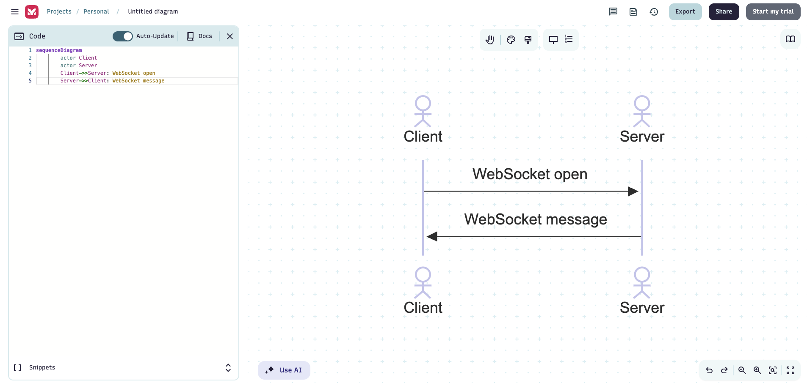
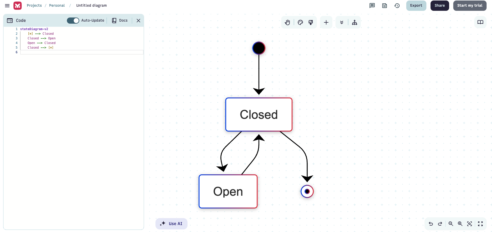

# UML diagrams

Unified Modeling Language (UML) is a general-purpose, object-oriented, visual modeling language that provides a way to visualize the architecture and design of a system, like a blueprint.

Why do we need it?

Engineering is about Abstraction skill, where we need to get or of non important i favour of important things. We can imagine an ATM as a box, with an interface, with Roles of Client, Vendor, Owner, where we are focusing on data, logic, and are not focusing on the OS installed, or the shopping mall where we will physically put it, right?

## UML diagram types

You can use different services to make UMLs, one of them is [Mermaid](https://docs.mermaidchart.com/mermaid-oss/intro/index.html). It covers all basic types of UML diagrams.

**I would recomment to focus on the following UML types, since they are most common:**

### Class diagrams

The main building block of OOD. Defines classes, properties, methods and relations between classes.

**Link:** [https://docs.mermaidchart.com/mermaid-oss/syntax/classDiagram.html](https://docs.mermaidchart.com/mermaid-oss/syntax/classDiagram.html)

### Sequence diagrams

Can be helpful, for example, in modeling of Clint-Server communication or when you have layers of communications.

**Link:** [https://docs.mermaidchart.com/mermaid-oss/syntax/sequenceDiagram.html](https://docs.mermaidchart.com/mermaid-oss/syntax/sequenceDiagram.html)

### State diagrams

If you need some state-related logic, for example some OOD things that have state.

**Link:** [https://docs.mermaidchart.com/mermaid-oss/syntax/stateDiagram.html](https://docs.mermaidchart.com/mermaid-oss/syntax/stateDiagram.html)

### Mindmap diagram

When you need to have some hierarchical connection between items.

**Link:** [https://docs.mermaidchart.com/mermaid-oss/syntax/mindmap.html#mindmap](https://docs.mermaidchart.com/mermaid-oss/syntax/mindmap.html#mindmap)
